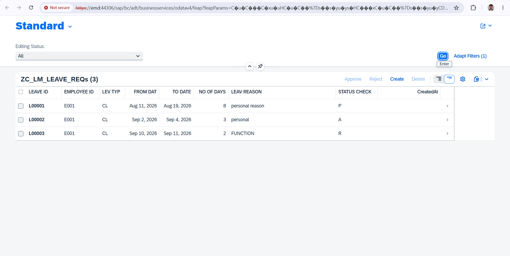
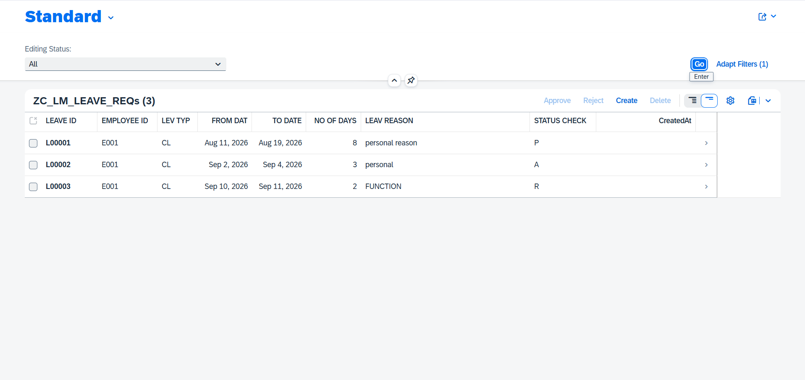
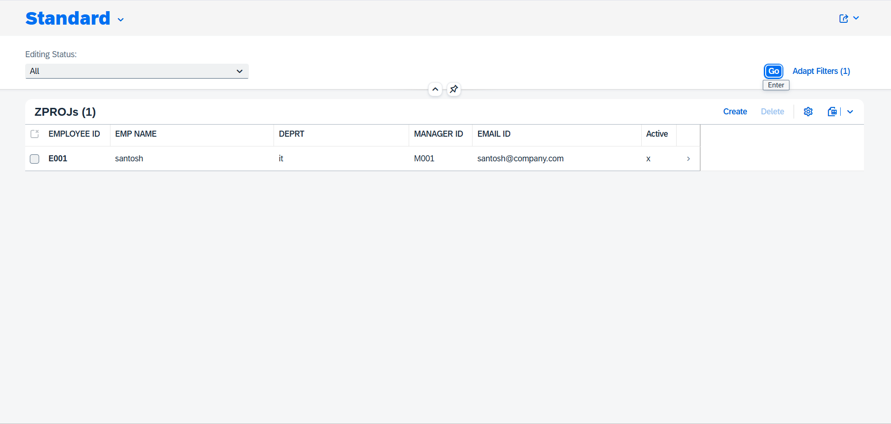
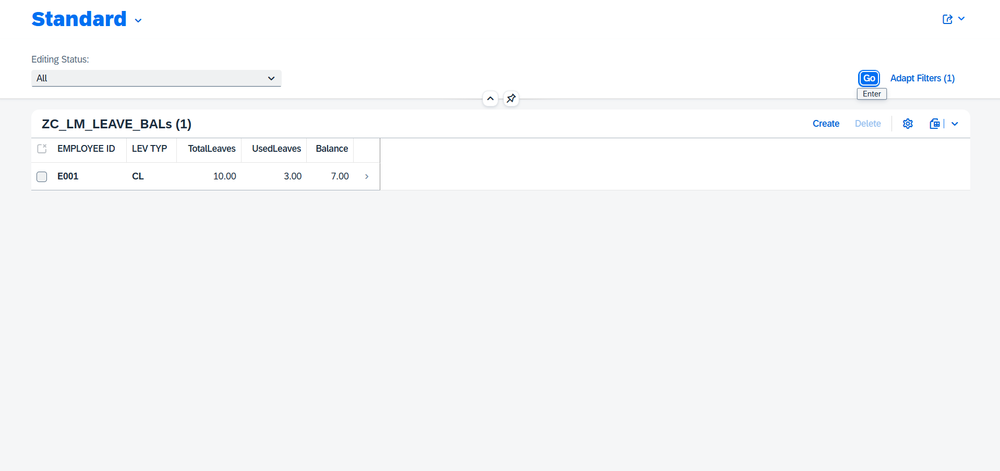

# SAP RAP Employee Leave Management

A SAP RAP based Employee Leave Management application built using
Fiori Elements and OData V4.

## Project Overview

This application manages employee leave requests from creation to approval.

### Main Features

- Create employee leave requests
- Automatic leave-day calculation
- Leave balance validation
- Date validation
- Overlapping leave validation
- Approve / Reject leave requests
- Leave balance management
- Fiori Elements UI
- OData V4 service
- Draft-enabled application

## Technology Stack

| Technology | Usage |
|---|---|
| SAP RAP | Application development |
| ABAP | Backend implementation |
| CDS Views | Data modelling |
| Fiori Elements | UI |
| OData V4 | Service exposure |
| Eclipse ADT | Development environment |
| SAP HANA | Database |

## Application Flow

Employee creates leave request
        ↓
Date & Balance Validation
        ↓
PENDING
        ↓
Manager Approval / Rejection
        ↓
APPROVED / REJECTED
        ↓
Leave Balance Updated

## Leave Request

The application provides a Fiori Elements list and object page
for managing leave requests.

Main fields:

- Leave ID
- Employee ID
- Leave Type
- From Date
- To Date
- Number of Days
- Leave Reason
- Status
- Approved By
- Approved At
- Manager Comment

## Business Validations

The application performs the following validations:

1. Date validation
2. Employee validation
3. Leave balance validation
4. Overlapping leave validation

## Leave Processing

### Pending

New leave requests are created with Pending status.

### Approve

Manager can approve a pending leave request.

### Reject

Manager can reject a pending leave request.

### Balance

Approved leave days are reflected in the employee leave balance.

## Fiori Elements UI

The final application runs in the browser using Fiori Elements
and OData V4.

Screens include:

- Leave Request List
- Create Leave Request
- Leave Request Object Page
- Approve / Reject actions
- Leave Balance

## Application Screenshots

### Leave Request List

### Create / Leave Request

### Employee Details

### Leave Balance

